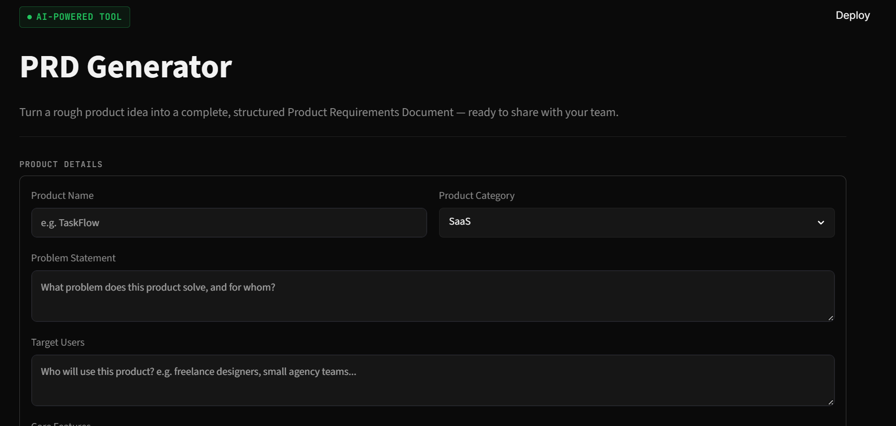
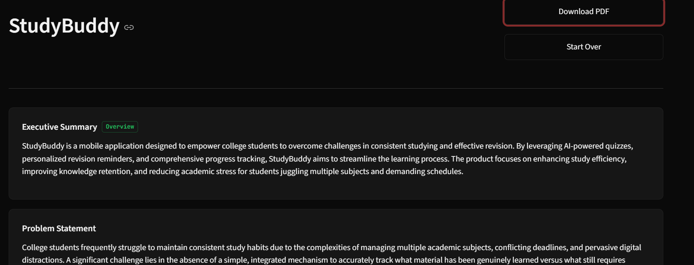
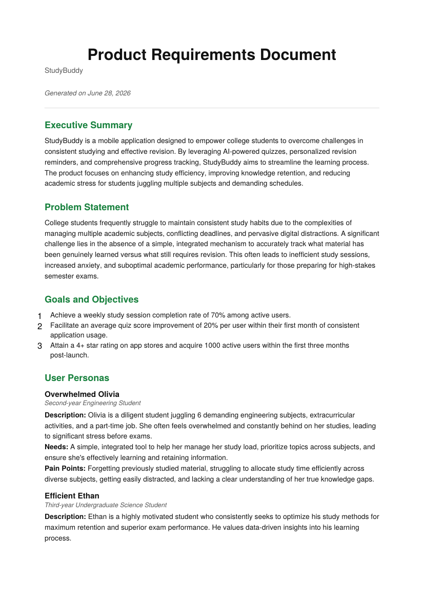

# PRD Generator

An AI-powered tool that turns a rough product idea into a complete,
structured Product Requirements Document (PRD) — the kind real product
managers and developers use to plan and build software.

Fill in a short form (product name, problem, target users, features...),
click **Generate PRD**, and get back a full PRD with an executive summary,
goals, personas, user stories, prioritized features, scope, success metrics,
timeline, and risks — viewable on screen and downloadable as a clean PDF.

---

## Screenshots

| Form | Generated PRD |
|---|---|
|  |  |

| PDF Export |
|---|
|  |

> Replace the images above with your own screenshots, saved inside a
> `screenshots/` folder at the project root (same level as `app.py`).

---

## Tech Stack

- **Frontend:** Streamlit
- **Backend:** Python
- **AI:** Gemini API (`google-genai` SDK, model `gemini-2.5-flash`)
- **PDF generation:** ReportLab

---

## Project Structure

```
prd-generator/
├── app.py                       # Main Streamlit app (UI + flow)
├── utils/
│   ├── __init__.py
│   ├── gemini_client.py         # Talks to the Gemini API, returns structured PRD JSON
│   └── report_generator.py      # Builds the downloadable PDF with ReportLab
├── components/
│   ├── __init__.py
│   └── styles.py                # All custom CSS (dark theme, no gradients)
├── requirements.txt
├── .env.example
├── .gitignore
├── LICENSE
└── README.md
```

---

## 1. Setup (Local)

### Step 1 — Clone / download this project

```bash
cd prd-generator
```

### Step 2 — Create a virtual environment (recommended)

> **Python version note:** Use Python 3.10–3.12. Very new Python versions
> (e.g. 3.14) often don't have pre-built installers yet for packages like
> `Pillow` (a dependency of ReportLab), which causes a confusing
> "Failed building wheel" error during `pip install`. If you have multiple
> Python versions installed on Windows, use `py -3.12` instead of `python`
> below to pick a stable one.

```bash
python -m venv venv

# On Mac/Linux
source venv/bin/activate

# On Windows
venv\Scripts\activate
```

### Step 3 — Install dependencies

```bash
pip install -r requirements.txt
```

### Step 4 — Add your Gemini API key

1. Get a free API key from [Google AI Studio](https://aistudio.google.com/apikey).
2. Copy `.env.example` to a new file named `.env`:

   ```bash
   cp .env.example .env
   ```

3. Open `.env` and paste your key:

   ```
   GEMINI_API_KEY=your_real_key_here
   ```

   > `.env` is already listed in `.gitignore`, so your key won't be committed by accident.

### Step 5 — Run the app

```bash
streamlit run app.py
```

The app will open automatically in your browser, usually at
`http://localhost:8501`.

---

## 2. How to Use

1. Fill in the **Product Details** form:
   - Product Name
   - Category (SaaS, Mobile App, Web App, API Tool, Other)
   - Problem Statement
   - Target Users
   - Core Features
   - Out of Scope
   - Success Metrics
2. Click **Generate PRD**. Gemini will turn your rough notes into a full,
   professional PRD (this usually takes 5–15 seconds).
3. Review the generated PRD on screen.
4. Click **Download PDF** to save a clean, print-ready PDF copy.
5. Click **Start Over** to clear everything and create a new PRD.

---

## 3. Deploying to Streamlit Cloud

1. Push this project to a GitHub repository (make sure `.env` is **not**
   included — `.gitignore` already handles this for you).
2. Go to [share.streamlit.io](https://share.streamlit.io) and connect your
   GitHub repo.
3. Set the main file path to `app.py`.
4. In the app's **Settings → Secrets**, add your key in this format:

   ```toml
   GEMINI_API_KEY = "your_real_key_here"
   ```

5. Deploy. Streamlit Cloud automatically installs everything listed in
   `requirements.txt`.

---

## 4. Notes on Design Decisions

- **Why `google-genai` and not `google-generativeai`?** The latter is the
  older, now-deprecated SDK. This project uses the current official SDK.
- **Why temperature `0.1`?** PRDs should be structured and consistent, not
  "creative." A low temperature keeps Gemini's output predictable.
- **Why is the PDF light-themed even though the app is dark-themed?**
  PRDs are usually printed or shared with stakeholders — a white background
  with dark text is the professional standard and avoids ink-heavy/illegible
  printouts.
- **Why a structured JSON response from Gemini?** Asking Gemini to return
  JSON (instead of free-form text) means the same code can reliably render
  the on-screen view and the PDF from one consistent data source, instead
  of trying to parse loosely-formatted text.

---

## 5. Troubleshooting

| Problem | Likely Cause | Fix |
|---|---|---|
| `GEMINI_API_KEY is missing` error | `.env` file not created or key not set | Copy `.env.example` to `.env` and add your real key |
| "Gemini returned a response that wasn't valid JSON" | Rare model hiccup | Click **Generate PRD** again |
| App won't start / import errors | Dependencies not installed | Run `pip install -r requirements.txt` again inside your virtual environment |
| PDF download button doesn't appear | PRD generation failed | Check the error message shown above the form and try again |
| `pip install` fails with "Failed building wheel for pillow" / mentions `zlib` or `RequiredDependencyException` | You're on a very new Python version (e.g. 3.14) that doesn't have a pre-built Pillow package yet | Run `pip install --upgrade pip` then `pip install --only-binary :all: pillow` before retrying `pip install -r requirements.txt`. If that still fails, install Python 3.12 and create your venv with `py -3.12 -m venv venv` instead |
| `cd` says a folder "does not exist" | Folder name typo (e.g. underscore vs hyphen) or wrong starting directory | Use `dir` (Windows) or `ls` (Mac/Linux) to see the exact folder name, then copy it exactly |
| Error mentions `429`, `RESOURCE_EXHAUSTED`, or "quota" | You've hit the free-tier rate limit for the Gemini API (shared across all apps using the same key) | Wait a minute and try again for per-minute limits. If you've hit the daily limit, wait until it resets (usually next day, Pacific time), or use a different API key. Check current limits at [ai.google.dev/gemini-api/docs/rate-limits](https://ai.google.dev/gemini-api/docs/rate-limits) |

---

## 6. License / Usage

This project is licensed under the **MIT License** — see the [LICENSE](LICENSE)
file for full details. In short: you're free to use, copy, modify, and
share this code (including for your own portfolio or learning), as long as
the original copyright notice is kept.

**Contributions:** This started as a personal/portfolio project, but
suggestions, bug reports, and pull requests are welcome if you'd like to
improve it.
